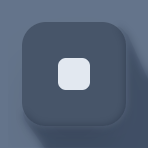
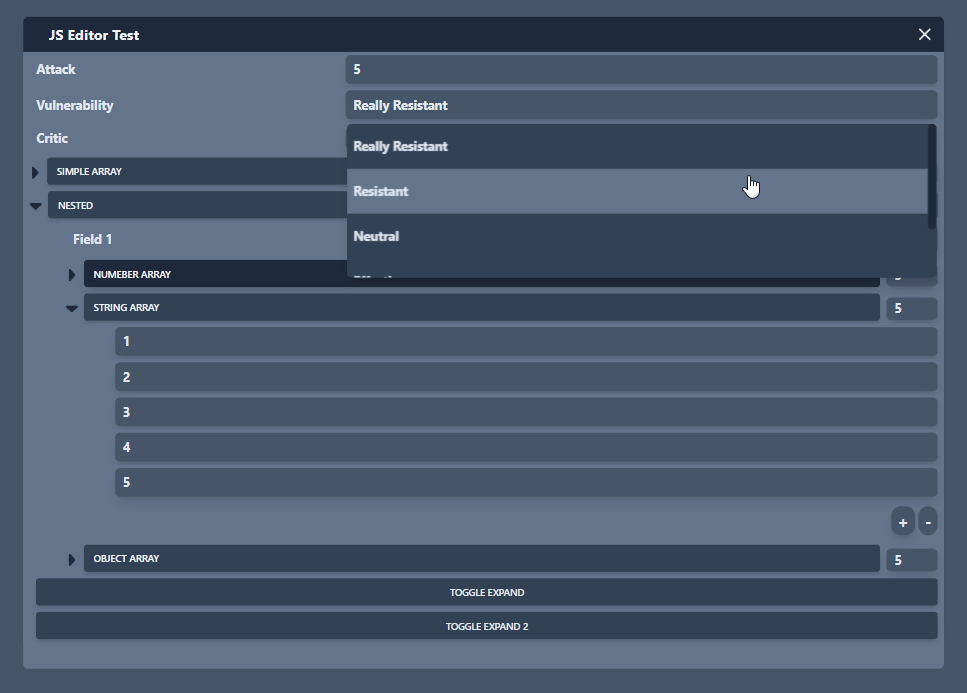

# JS Editor

<center>



</center>

# What is this?

This is a personal project aimed to help me do simple programs to manipulate data. I created this with the intention of managing roleplaying campaigns, but it can be used for anything. Currently this app works by importing special js modules, but in the future everything will be done through a GUI.

WARNING: This software is in an early stage. I can't guarantee your data won't be lost.

# Features

The application currently supports the following features:

- Windows system (resizable, movable, closable)
- Zoom and pan
- Saving and loading boards
- Text Labels
- Numeric Labels
- Checkboxes
- Dropdowns
- Buttons (functions)
- Object Labels
- Array Labels
- Simple API

# How to create a module

This app takes js modules. It must provide a default export. Only the default export is used. If the object uses other items from the module, it will fail. There is some error handling, but it's not perfect. If you manage to make the app crash it will ask you if you want to delete local storage, if you do, it will reset the app. I recommend you to save the board every once in a while.

# Fields

The module must be an object. The object can have any fields, string, bool, functions... But if you want to use special fields you need to use a special format. Don't worry, it's not compulsory to use both, you can use the JSON format for simple fields and the real one for special fields.

Example using [normal JSON](./public/examples/simpleObject.js):

Example using [special fields](./public/examples/exampleObject.js):

You may have notice Dropdown is a type and not an attribute. There are some design choices behind that I won't cover now, but I wanted to make it clear.

## WIN_TITLE field

As you can see in the example, WIN_TITLE is a special field name, it's currently the only "reserved" field name. It's used to set the window title. If you don't use it, the window will be called "Window" plus it index number.

# Supported types

The following types are supported:

- ``String``: A simple text field.
- ``Number``: A simple number field.
- ``Bool``: A checkbox.
- ``Object``: A label with the object's keys and values.
- ``Array``: A label with the array's values.
- ``Function``: A button that executes the function. It always receives the object as first parameter and an api object as second parameter. It's explained later.
- ``Dropdown``: A dropdown with the options provided. 
  - This type has a special field called ``options``. It must be an array of strings.
  - This type has a special field called ```values``. It must be an array of any types. It must be the same length as the options array. Think of it as a map. The value of the dropdown will be the value of the selected option. In the future I might change this to an array of objects, but for now it's like this.

# Attributes

The following attributes are supported:

- ``READ_ONLY``: Makes the field read only. It can't be modified by the user throught the interface, but functions can modify it (javascript thing, I can't do anything there).
- ``HIDDEN``: Hides the field. It won't be rendered.
- ``EXPANDED``: Expands the field, it only works for objects and arrays.

# Functions

Functions are supported. They are rendered as buttons. They always receive the object as first parameter and an api object with functions as second parameter. The reason for that is because you can't access the object from the outside, so you need to pass it as a parameter. The api object is explained later.

# Api

The api object has the following functions:
- ``serializeJsAsText(jsObject):`` Converts the jsObject to a string.
- ``deserializeJsAsText(jsObject):`` Converts the string to a jsObject.
- ``makeReadOnly(jsObject):`` Returns a new object with the same keys and values as the jsObject, but all the fields have the READ_ONLY attribute. Original object is not modified.
- ``makeHidden(jsObject):`` Returns a new object with the same keys and values as the jsObject, but all the fields have the HIDDEN attribute. Original object is not modified.
- ``add(jsObject):`` Adds the jsObject to the app. All the fields that are not in the editor format will be converted. It will be rendered as a new window.
- ``addFromFile``: Adds a jsObject from a file. It will be rendered as a new window.
- ``convertToPureValues(jsObject)``: Returns a copy of the object in JSON format. It will remove all the special fields and attributes. Check [the example](public/examples/convertToPureValues.md) for more info. Original object is not modified. This method is useful if you want to create a calculator or something like that, as it wouldn't be comfortable doing field.value.nested.value.string.value etc...
- ``convertToEditorObject(jsObject)``: Returns a copy of the object in editor format. It will add the type and value, with no attribute field. Type is inferred from the value, so it can't infer dropdowns. Original object is not modified.
- ```getAttribute(jsObject, attribute: string)``: Returns true if the attribute is present in the jsObject, false otherwise.
- ``addAttribute(jsObject, attribute: string)``: Adds the attribute to the jsObject. If the attribute is already present, it does nothing. ``**Returns**`` the jsObject. If it wasn't an editor object (with type and value fields), it will be converted to one.
- ``removeAttribute(jsObject, attribute: string)``: Removes the attribute from the jsObject. If the attribute is not present, it does nothing. ``**Returns**`` the jsObject. If it wasn't an editor object (with type and value fields), it will be converted to one.
- ``clear``: Clears the board. It will remove all the windows and will also clear the local storage.
- ``loadFromFile``: Loads the config from a file, clearing the previous board and config.
- ``saveToFile``: Saves the board and the config (position and scale of canvas) to a file.
- ``getItems``: Returns an array with all the items in the board. Be aware they are in the editor format (with type and value fields).
- ``updateView``: Updates the view. It will re-render all the windows. Useful if you modify the object from the outside. If you add a hidden attribute, or a read only attribute, you need to call this function to update the view.

# Render example

This is how the [example object](public/examples/exampleObject.js) is rendered:

